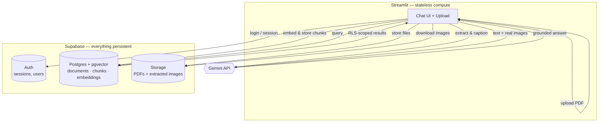

# 🧠 DocuMind AI

**Ask questions. Understand documents. Get grounded answers.**

<p>


</p>

A production, multi-user **multimodal Retrieval-Augmented Generation (RAG)** platform — not a notebook demo. Upload any structured PDF (research papers, technical docs, financial reports, manuals) and ask questions that get answered from its actual text, tables, *and* charts, with every claim traceable back to a specific page.

**[Live demo →](#)** &nbsp;·&nbsp; Built solo, end-to-end, including the parts that don't show up in a screenshot: authentication, per-user data isolation enforced at the database level, and a persistence architecture that survives a redeploy.

## Table of contents

- [Why this isn't another "RAG tutorial" project](#why-this-isnt-another-rag-tutorial-project)
- [Screenshots](#screenshots)
- [Architecture](#architecture)
- [How it works](#how-it-works)
- [Evaluation](#evaluation)
- [Key engineering decisions](#key-engineering-decisions)
- [Testing & verification philosophy](#testing--verification-philosophy)
- [Tech stack](#tech-stack)
- [Skills demonstrated](#skills-demonstrated)
- [Getting started](#getting-started)
- [Project structure](#project-structure)
- [Roadmap](#roadmap)
- [Known limitations](#known-limitations)

---

## Why this isn't another "RAG tutorial" project

Most PDF-chatbot projects stop at "it answers questions from a document." This one exists because that's the easy 20%. A few specific things that separate it from a weekend tutorial clone:

- **Charts don't get silently dropped.** Most raster-only image extraction misses vector-drawn charts (the kind Excel/PowerPoint exports produce) with no error — just a quietly incomplete index. This pipeline rasterizes every page as a fallback, verified against a synthetic PDF containing a pure-vector chart that raster extraction found *zero* images on.
- **The generator sees real pixels, not just captions.** Retrieval finds images via their captions, but the LLM is handed the actual downloaded image at generation time — verified with a test that asserts a real `PIL.Image` object, not a path string, reaches the model.
- **Multi-tenant isolation is enforced by Postgres, not application code.** Row-Level Security policies mean a user genuinely cannot read — or even forge a write into — another user's data. Verified by connecting as a non-superuser database role and confirming both the read-block and the write-block directly, not just trusting the policy syntax.
- **Two real architecture decisions got reversed after hitting real problems, not guessed correctly upfront:** BLIP → Gemini for image captioning, after BLIP's captions on financial charts turned out to be near-content-free ("a table with numbers," repeated across dozens of distinct charts). ChromaDB → Postgres/pgvector, after realizing local vector files don't survive a redeploy and that two separate systems (Chroma + Postgres) could let a deleted document's chunks silently orphan. Both are detailed below, not just mentioned.
- **The evaluation framework is custom, on purpose.** Ragas was the first choice — until testing turned up a real bug in its Google-provider async handling (confirmed against the actual installed package, not just its docs). The custom LLM-as-judge evaluator that replaced it is smaller, transparent, and actually works.

---

## Screenshots

<!--
Replace these with real captures once you have the deployed URL handy:
  1. The welcome / suggested-questions state (empty chat)
  2. A chart-grounded answer with the "Sources" expander open, showing the retrieved image
  3. The sidebar document list mid-processing (uploading → processing → completed)
A screenshot of #2 specifically is the single highest-impact image for this
project, since it's visual proof of the multimodal retrieval actually working.
-->

| Welcome state | Grounded answer with cited image |
|---|---|
|||

---

## Architecture



**The one-sentence version:** Streamlit holds no state of its own — every user account, document, embedding, and file lives in Supabase, so a redeploy or server restart loses nothing. Gemini is called twice per document lifecycle (captioning images at ingest time, generating answers at query time) and stores nothing itself.

---

## How it works

### Ingestion (when a PDF is uploaded)
1. **Extract** — `PyMuPDF` pulls text and embedded raster images per page; `pdfplumber` extracts tables and serializes them to markdown (tables are structured data — they retrieve far better as text than as pictures). Every page is *also* rendered as a full-page image, specifically to catch vector-drawn charts that raster extraction can't see.
2. **Caption** — every extracted image goes to Gemini with a prompt asking for chart type, axis labels, and specific figures — the searchable "bridge" between a text query and a picture.
3. **Chunk & embed** — page text is split into ~350-word overlapping chunks (a whole page in one vector dilutes the signal too much to retrieve precisely); everything — text, tables, captions — is embedded with one model (`BAAI/bge-small-en-v1.5`) so a single query vector can retrieve all three side by side.
4. **Store** — chunks + embeddings go into Postgres (`pgvector`), tagged with `user_id`; the original PDF and every extracted image go to Supabase Storage, namespaced `{user_id}/{document_id}/...`.

### Query (when a question is asked)
1. The question is embedded with the *same* model used at index time.
2. Two separate vector searches run — top text/table chunks, and top image chunks — via a Postgres RPC (`match_chunks`) that ranks by cosine distance *and* filters to the authenticated user's rows in one call.
3. Matched images are downloaded from Storage and decoded.
4. Gemini receives the retrieved text **and the real images**, with an explicit instruction to answer only from what's provided and say so when it can't — never guess.
5. The answer streams back with per-claim source citations (document + page number).

---

## Evaluation

A custom LLM-as-judge evaluator (`src/evaluate.py`) measures what the system actually gets right, not just that it runs:

| Metric | Result |
|---|---|
| Average faithfulness (hallucination check) | 1.00 |
| Average retrieval hit rate | 1.00 |
| Correct refusal on unanswerable questions | 1/1 |

**Honest caveat, stated on purpose:** this is a hand-curated evaluation set of 15 questions, not a large benchmark — a perfect score here is evidence the approach works, not a universal accuracy claim. The judge model is also a different model family than the generator specifically to reduce same-model grading bias.

---

## Key engineering decisions

<details>
<summary><b>Why ChromaDB first, then a full migration to Postgres/pgvector</b></summary>

<br>

Chroma was the right call for early local development — zero setup, a folder on disk, fast iteration on the retrieval logic itself. It stopped being right once the project needed to be a deployed, multi-user app, for two concrete reasons:

1. Streamlit Community Cloud's own docs state that local file storage isn't guaranteed to persist across a redeploy. Chroma's entire index is local files.
2. With a real `documents` ownership table in place, deleting a document should delete its chunks too. As two separate systems, that meant two independent deletes that could drift out of sync.

pgvector solves both by living inside the *same* Postgres database as `documents` — `document_id uuid references documents(id) on delete cascade` turns problem #2 into a schema constraint instead of application code that has to remember. Verified directly: stood up a real local Postgres + pgvector instance, deleted a document, confirmed its chunks vanished automatically — not assumed from documentation.
</details>

<details>
<summary><b>Why Gemini replaced BLIP for image captioning</b></summary>

<br>

BLIP is trained on natural photos and has no real reading comprehension of a chart — it produced near-identical, low-information captions ("a table with numbers") across dozens of visually distinct financial charts, making them nearly indistinguishable to the retriever. Gemini can actually read the axis labels and figures off the image. The switch happened after inspecting real output, not as a default first choice.
</details>

<details>
<summary><b>Why Row-Level Security instead of just filtering in application code</b></summary>

<br>

Application-level `WHERE user_id = ...` filtering is one missed line away from a data leak. RLS makes Postgres itself the enforcement point, regardless of what the app code does or forgets. Tested directly as a non-superuser role: a second user's query for another user's chunks returns zero rows, and an attempted write forging someone else's `user_id` is rejected outright — not just theoretically blocked by policy syntax.
</details>

<details>
<summary><b>Why a custom evaluator instead of Ragas</b></summary>

<br>

Ragas was the first choice, matching what most RAG tutorials use. Wiring it to Gemini surfaced a real bug: every documented integration path (the current `llm_factory` + `google-genai`, `llm_factory` + the legacy `google-generativeai` SDK, and the deprecated `LangchainLLMWrapper`) constructs without error, then fails identically at call time with an async-detection error inside Ragas itself — confirmed against the installed package, not just by reading docs describing behavior that didn't actually work. The replacement is a small, transparent LLM-as-judge script built on the same Gemini client already used elsewhere in the project — no new dependency, and every failure mode is visible instead of hidden inside a framework.
</details>

---

## Testing & verification philosophy

Every non-trivial claim in this repo was checked against something real before being trusted, not assumed from documentation:

- **Service wrappers** (`auth_service`, `db_service`, `storage_service`) are unit-tested against mocked clients, asserting the *exact* call each function makes — not just that it "doesn't crash."
- **Security guarantees are tested as an attacker would test them**, not just read as policy syntax: connected as a genuine non-superuser Postgres role and confirmed a second user's read returns zero rows *and* their write attempting to forge another user's `user_id` is rejected.
- **Data-integrity guarantees are tested by triggering them**, not inferred: inserted a document and its chunk, deleted the document, and confirmed the chunk was actually gone — proving the cascade, not assuming the foreign key syntax is correct.
- **Multimodal grounding is tested end-to-end**, asserting a real decoded image object (not a placeholder or path string) reaches the generation call.
- Every UI change is checked with a bare Python run (catches real exceptions past Streamlit's own harmless warnings) plus a live `streamlit run` boot with log inspection before being called done.

---

## Tech stack

| Layer | Choice | Why |
|---|---|---|
| UI | Streamlit | Fastest path to a real multi-user app without hand-building a frontend; native session state and theming were enough to avoid needing a separate frontend framework. |
| LLM (generation + captioning + judge) | Gemini API (`google-genai`) | Genuinely free tier, natively multimodal (reads real images, not just OCR'd text), one SDK for three different jobs in the pipeline. |
| Embeddings | `sentence-transformers` (`BAAI/bge-small-en-v1.5`) | Strong small-model retrieval quality, runs on CPU — no GPU dependency for a project that needs to stay deployable for free. |
| Vector store | PostgreSQL + `pgvector` (via Supabase) | One persistent system instead of two that can drift apart; native `ON DELETE CASCADE` and Row-Level Security apply to vectors exactly like every other table. |
| Auth | Supabase Auth | Managed session handling and password hashing — no hand-rolled auth code to get subtly wrong. |
| File storage | Supabase Storage | Same project as the database and auth; one place to manage credentials and one place data actually persists. |
| PDF parsing | PyMuPDF, pdfplumber | Complementary strengths — PyMuPDF for text/image extraction and page rasterization, pdfplumber specifically for table structure. |

---

## Skills demonstrated

`Multimodal RAG` `Vector Search & Embeddings` `Prompt Engineering` `LLM-as-Judge Evaluation` `PostgreSQL & pgvector` `Row-Level Security` `Authentication & Session Management` `Database Schema Design (FKs, cascades, migrations)` `Cloud Deployment` `API Integration (Gemini, Supabase)` `Python (OOP, testing, mocking)` `Technical Debugging of Third-Party Libraries`

---

## Getting started

```bash
git clone <your-repo-url>
cd <repo>
pip install -r requirements.txt
cp .env.example .env   # fill in GOOGLE_API_KEY, SUPABASE_URL, SUPABASE_ANON_KEY
```

1. Create a free project at [supabase.com](https://supabase.com), then run `supabase_schema.sql` in its SQL Editor.
2. Get a free Gemini API key at [aistudio.google.com](https://aistudio.google.com).
3. Run it:

```bash
streamlit run app.py
```

Optional CLI tools (bulk indexing, evaluation, a REPL for quick testing without the UI) live in `src/` and authenticate the same way the app does — see each file's docstring.

---

## Project structure

```
.
├── app.py                    # Streamlit UI — auth gate, chat, document management
├── requirements.txt
├── supabase_schema.sql       # tables, RLS policies, match_chunks() vector search function
├── .env.example
└── src/
    ├── ingest.py              # PDF → text / tables / images
    ├── embed_and_index.py     # captioning, chunking, embedding, Postgres + Storage writes
    ├── rag_pipeline.py        # retrieval (match_chunks RPC) + Gemini generation
    ├── auth_service.py        # Supabase Auth wrapper
    ├── db_service.py          # Postgres document metadata CRUD
    ├── storage_service.py     # Supabase Storage upload/download
    └── evaluate.py            # custom LLM-as-judge evaluation harness
```

---

## Roadmap

- [ ] Persist chat history (`conversations`/`messages` tables already exist and are RLS-protected — the app just doesn't write to them yet)
- [ ] Delete-document UI, with matching Storage cleanup
- [ ] Cross-document search ("compare these two reports") as an explicit multi-document mode
- [ ] Dark mode visual QA pass
- [ ] Larger, more diverse evaluation set (50+ questions across more document types)

## Known limitations

Stated directly rather than discovered by a reader — this is what's left, not swept under the rug:

- Chat history isn't persisted yet — the `conversations`/`messages` schema exists and is RLS-protected, but the app doesn't write to it. Documents and their embeddings persist across sessions; the transcript of past conversations doesn't.
- The 15-question evaluation set is a meaningful smoke test, not a large-scale benchmark.
- Two different users uploading a file with an *identical name* at the same moment can race on local temp-file paths during processing (final storage is correctly namespaced per user; only the brief local scratch step isn't).

## License

MIT
